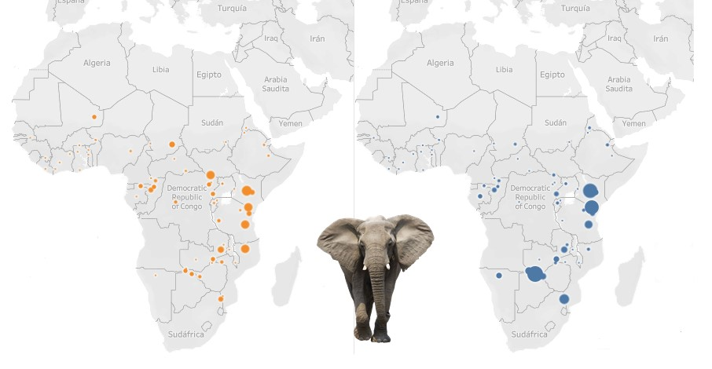

# EL VERDADERO PRECIO DEL MÁRFIL

[Acceso al Tableau](https://public.tableau.com/app/profile/ana6985/viz/Dashboard_Project_16758088759550/END?publish=yes)

En las últimas décadas el número de elefantes ha descendido de manera drástica y los cazadores furtivos han jugado un papel fundamental en ello. 

En este Tableau voy a presentar datos del número de elefantes cazados de manera ilegal en los últimos años, así como el descenso de la población de elefantes, tanto en África como en Ásia y precios de diferentes artículos de marfil.

En los mapas se muestran el número de elefantes muertos por causa natural vs los cazados ilegalmente (azul: causa natural / naranja: caza furtiva)

El total de cuerpos encontrados dividido por el número de muertes ilegales da como resultado el PIKE (Proportion Ilegal Killing of Elephants). Este fue un sistema implementado por el programa MIKE (Monitoring of Ilegal Killing of Elephants) para poder hacer un seguimiento de la caza furtiva y ver su tendencia evitando la diferencia que se podría producir en las diferentes localizaciones debido a la situación individual de cada uno.

## ESTRUCTURA CARPETAS
He creado 3 carpetas en el repositorio. 
- **datos**: aquí se encuentran todos los csv utilizados en el Tableau
- **imagenes**: todas las imagenes que aparecen en los diferentes dashboards
- **notebooks**: un archivo .ipynb con la extracción y limpieza de algunos archivos utilizados en el Tableau

## TECNOLOGÍA
[pandas](https://pandas.pydata.org/docs/): para operar con pandas en el notebook.

## FUENTE DE DATOS
[Convention on International Trade in Endangered Species of Wild Fauna and Flora](https://cites.org/)

[Enviromental Investigation Agency](https://reports.eia-international.org/)

[The Ivory Markets of East Asia Esmond](https://traffic.org)

[CITES Monitoring the Illegal Killing of Elephants](https://citesmike.org/)

[African Elephant Database](https://africanelephantdatabase.org/)

[Global Biodiversity Information Facility](https://www.gbif.org/)

[National Geographic](https://www.nationalgeographic.es/)

[The IUCN Red List](https://www.iucnredlist.org/)

[The Proceedings of the National Academy of Sciences](https://www.pnas.org/)

https://hdr.undp.org/ (Source: UNDP (United Nations Development Programme). 2022. Human Development Report 2021/2022: Uncertain Times, Unsettled Lives: 
Shaping our Future in a Transforming World. New York.)